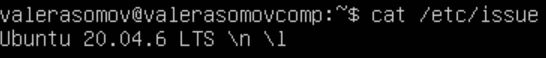

# Linux_01

## Part 1. Установка ОС

== Задание ==
Установи Ubuntu 20.04 Server LTS без графического интерфейса. (Используем программу для виртуализации - VirtualBox)

```
cat /etc/issue
```



## Part 2. Создание пользователя

gfggfd
вывыввыв
аываыаы
ew
ввы
dfdas
вфывфы
