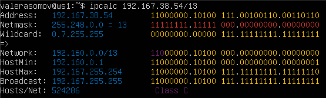
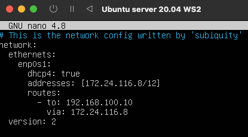
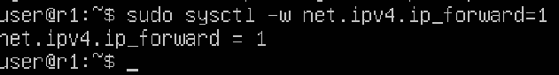
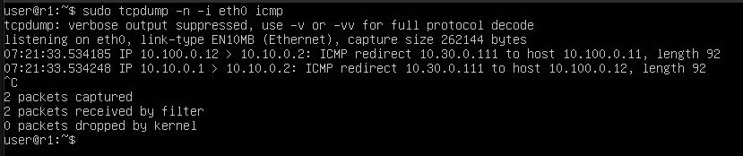
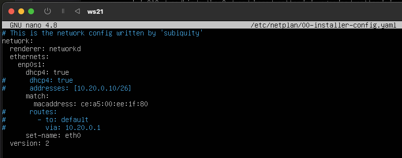
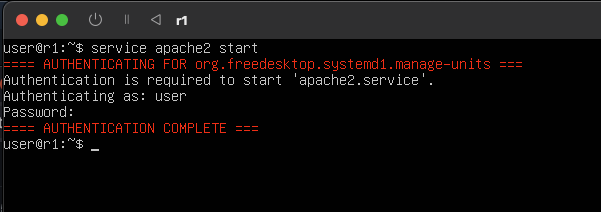
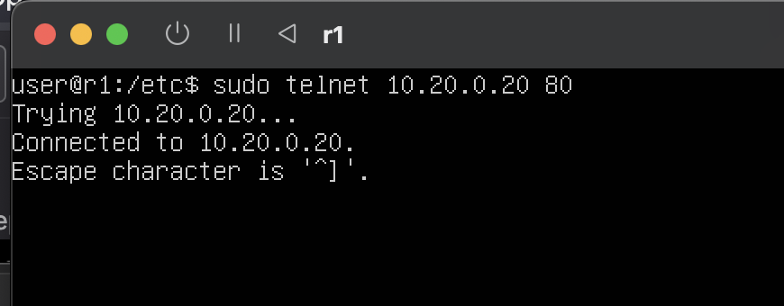
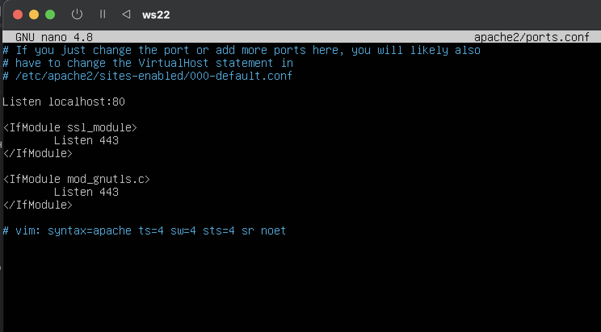

# Сети в Linux
Настройка сетей в Linux на виртуальных машинах.

## Contents
[1. Инструмент ipcalc](#1-инструмент-ipcalc)  
[2. Статическая маршрутизация между двумя машинами](#2-статическая-маршрутизация-между-двумя-машинами)  
[3. Утилита iperf3](#3-утилита-iperf3)  
[4. Сетевой экран](#4-сетевой-экран)  
[5. Статическая маршрутизация сети](#5-статическая-маршрутизация-сети)  
[6. Динамическая настройка IP с помощью DHCP](#6-динамическая-настройка-ip-с-помощью-dhcp)  
[7. NAT](#7-nat)  
[8. Дополнительно. Знакомство с SSH Tunnels](#8-дополнительно-знакомство-с-ssh-tunnels)  


## 1. Инструмент ipcalc  
Поднял виртуальную машину ws1 для macOS с использованием UTM.  
  
*Виртуальная машина ws1*  
### 1.1. Сети и маски  
Определил следующее:  

1. Адрес сети 192.167.38.54/13  

Использовал команду ```ipcalc 192.167.38.54/13```.   
Адрес сети - Adress ```192.167.38.54```.  
  
*Результат исполнения команды для заданного ip-фадреса*  

2. Перевод маски 255.255.255.0 в префиксную и двоичную запись, /15 в обычную и двоичную, 11111111.11111111.11111111.11110000 в обычную и префиксную  
>Префиксная запись (prefix notation). Краткий формат записи маски подсети, в котором указывается только количество единичных битов в маске после косой черты. Например, /24 описывает маску с 24 единичными битами, т.е. маску сети класса С.  

Использовал команду ```ipcalc 0.0.0.0 255.255.255.0```.  
Префиксная запись маски - Network ```/24```, двоичная запись - Netmask ```00000000.00000000.00000000.00000000```.  
  
*Результат исполнения команды для нулевого ip-адреса и заданной маски сети*  

Использовал команду ```ipcalc 0.0.0.0/15```.  
Обычная запись маски - Netmask ```255.254.0.0```, двоичная запись - Netmask ```11111111.11111110.00000000.00000000```.  
  
*Результат исполнения команды для нулевого ip-адреса и заданной маски сети префиксного вида*  

Команда ```ipcalc``` не принимает двочиную запись маски, потому преобразуем маску в десятичное представление. ```11111111.11111111.11111111.11110000 = 255.255.255.240```.  
  
*Результат исполнения команды до преобразования маски*  

Использовал команду ```ipcalc 0.0.0.0 255.255.255.2400```.  
Обычная запись маски - Netmask ```255.255.255.240```, префиксная запись - Network ```/28```.  
  
*Результат исполнения команды после преобразования маски*  

3. Минимальный и максимальный хост в сети 12.167.38.4 при масках: /8, 11111111.11111111.00000000.00000000, 255.255.254.0 и /4.
Использовал команду ```ipcalc 12.167.38.4/8```.  
Минимальный хост - Hostmin ```12.0.0.1```, максимальный хост - Hostmax ```12.255.255.254```.  

  
*Результат исполнения команды*  

Использовал команду ```ipcalc 12.167.38.4/16```, потому что двоичное представление маски ```ipcalc``` не принимает (см. задание пп. 2).  
Минимальный хост - Hostmin ```12.167.0.1```, максимальный хост - Hostmax ```12.167.255.254```. 
 
  
*Результат исполнения команды*  

Использовал команду ```ipcalc 12.167.38.4 255.255.254.0```.  

Минимальный хост - Hostmin ```12.167.38.1```, максимальный хост - Hostmax ```12.167.39.254```.  
  
*Результат исполнения команды*  

Использовал команду ```ipcalc 12.167.38.4/4```.  

Минимальный хост - Hostmin ```0.0.0.1```, максимальный хост - Hostmax ```15.255.255.254```.  
  
*Результат исполнения команды*  

### 1.2. localhost  
Определил, можно ли обратиться к приложению, работающему на localhost, со следующими IP: 194.34.23.100, 127.0.0.2, 127.1.0.1, 128.0.0.1.  

Использовал команду ```ipcalc 194.34.23.100```, ```ipcalc 127.0.0.2```, ```ipcalc 127.1.0.1```, ```ipcalc 128.0.0.1```.  
>  Обратная петля loopback позволяет компьютеру связываться с самим собой, используя протоколы сетевых подключений. Т.е. если Loopback есть, то localhost.  

В результате исполнения команд ```ipcalc 194.34.23.100``` - нет, ```ipcalc 127.0.0.2``` - да, ```ipcalc 127.1.0.1``` - да, ```ipcalc 128.0.0.1``` - нет., ```ipcalc 127.0.0.2``` - да, ```ipcalc 127.1.0.1``` - да, ```ipcalc 128.0.0.1``` - нет.  
  
  
  
  
*Результат исполнения команды для 4-х ip-адресов*  

### 1.3. Диапазоны и сегменты сетей  
Определил следующее:  

1. Какие из перечисленных IP можно использовать в качестве публичного, а какие только в качестве частных: 10.0.0.45, 134.43.0.2, 192.168.4.2, 172.20.250.4, 172.0.2.1, 192.172.0.1, 172.68.0.2, 172.16.255.255, 10.10.10.10, 192.169.168.1
Использовал команду ```ipcalc ip-address```.
> Все IP-адреса протокола IPv4 делятся на публичные/глобальные/внешние (их называют "белые") — они используются в сети Интернет, и частные/локальные/внутренние (их называют "серые") — используются в локальной сети. Если есть privat Internet, то данный ip нельзя использовать в качестве публичного.   

В результате исполнения команд:  
```ipcalc 10.0.0.45``` - нет.  
  
*Результат исполнения команды ipcalc 10.0.0.45*  
```ipcalc 134.43.0.2``` - да.  
  
*Результат исполнения команды ipcalc 134.43.0.2*  
```ipcalc 192.168.4.2``` - нет.  
  
*Результат исполнения команды ipcalc 192.168.4.2*  
```ipcalc 172.20.250.4``` - нет.  
  
*Результат исполнения команды ipcalc 172.20.250.4*  
```ipcalc 172.0.2.1``` - да.  
  
*Результат исполнения команды ipcalc 172.0.2.1*  
```ipcalc 172.16.255.255``` - нет.  
  
*Результат исполнения команды ipcalc 172.16.255.255*  
```ipcalc 10.10.10.10``` - нет.  
  
*Результат исполнения команды ipcalc 10.10.10.10*  
```ipcalc 10.10.1.255``` - нет.  
  
*Результат исполнения команды ipcalc 10.10.1.255*  

2. Какие из перечисленных IP-адресов шлюза возможны у сети 10.10.0.0/18: 10.0.0.1, 10.10.0.2, 10.10.10.10, 10.10.100.1, 10.10.1.255  

Командой ```ipcalc 10.10.0.0/18``` получаем диапазон для хоста - ```10.10.0.1 - 10.10.63.254```.  
  
*Результат исполнения команды ipcalc 10.10.0.0/18*  
В результате исполнения команд:  
10.0.0.1 ip адрес НЕ возможмен у сети 10.10.0.0/18.
10.10.0.2 ip адрес возможмен у сети 10.10.0.0/18.
10.10.10.10 ip адрес возможмен у сети 10.10.0.0/18.
10.10.100.1 ip адрес НЕ возможмен у сети 10.10.0.0/18.
10.10.1.255 ip адрес возможмен у сети 10.10.0.0/18.


## 2. Статическая маршрутизация между двумя машинами  
Поднял две виртуальные машины -- ws1 и ws2. ws1 - см. раздел пп. 1.  
  
*Виртуальная машина ws2*  
С помощью команды ip a посмотрел существующие сетевые интерфейсы.  
  
*Существующие сетевые интерфейсы ws1*  
  
*Существующие сетевые интерфейсы ws2*  

Описал сетевой интерфейс, соответствующий внутренней сети, на обеих машинах и задал следующие адреса и маски: ws1 — 192.168.100.10, маска /16, ws2 — 172.24.116.8, маска /12.  
  
*Содержание изменённого файла etc/netplan/00-installer-config.yaml ws1*  
  
*Содержание изменённого файла etc/netplan/00-installer-config.yaml ws2*  

Выполнил команду ```sudo netplan apply``` для перезапуска сервиса сети и ```ip a``` чтобы посмотреть, что из этого получилось.  
  
*Выполнение команд ```sudo netplan apply``` и ```ip a``` ws1*  
  
*Выполнение команд ```sudo netplan apply``` и ```ip a``` ws2*  

2.1. Добавление статического маршрута вручную.  
Добавил статический маршрут от одной машины до другой и обратно при помощи команды вида ```ip r add```. В результате использовал команды ```sudo ip route add 192.168.100.10 dev enp0s1``` для ws2 и  ```sudo ip route add 172.24.116.8 dev enp0s1``` для ws1. Для коккретнйо работы также мзменил dhcp4 на true.  
   
  
*Изменение значение dhcp4 на true*  
Самое важное!!! настройка сети самой машины. По умолчанию сеть автоматическая, необходимо изменить сеть так, чтобы у ws1 и ws2 была одинаковая сеть.  

  
  
*Выполнение команд вида ```ip r add``` и ```ip r``` для ws1 и ws2*  

Для проверки результата выполнил команду ```ping 192.168.100.100``` для ws2 ```ping 172.24.116.6``` для ws1.  
  
  
*Выполнение команд вида ```ping 192.168.100.100``` для ws2 ```ping 172.24.116.6``` для ws1*  

2.2. Добавление статического маршрута с сохранением.  
С помощью команды ```reboot``` перезапустил обе машины.  
Добавил статический маршрут от одной машины до другой с помощью файла /etc/netplan/00-installer-config.yaml. После применили изменения командой ```sudo netplay apply```.    
  
   
*Настройка файла конфигурации для ws1 и ws2*  

В этот момент я понял, что лучше изменить установленные машины для UTM с открытием настроек network. Потому далее машины ws1 и ws2 вновь установленные серверы ubuntu 20.04 но уже с расширением для network. Сделанное до этого момента на старых серверах - продублировано.  
  
  
*Результат исполнения команды ```ping ip-адрес``` для ws1 и ws2*  

## 3. Утилита iperf3  
3.1. Скорость соединения  

Перевел: 8 Mbps в MB/s, 100 MB/s в Kbps, 1 Gbps в Mbps.  
> https://www.dataunitconverter.com/megabyte-per-second-to-kilobit-per-second/100 Вот онлайн калькулятор. Им воспользовался.   

|№ пп |Вводное |Результат |
|-----|--------|----------|
|1|8 Mbps|1 Mb/s|
|2|100 MB/s|800 000 kbps|
|3|1 Gbps|1 000 Mbps|  

3.2. Утилита iperf3  

Измерил скорость соединения между ws1 и ws2.  
> https://www.baeldung.com/linux/network-speed-testing Вот тут читал.  

Сначала командой ```iperf3 -s``` настроил для запуска iperf в режиме сервера, чтобы быть готовыми к приему входящих подключений. Сделал так на ws1 и ws2. Скорость соединения определел командой ```iperf3 -c 192.168.100.10```, запущенной на сервере ws2.  
  
*Применение команды ```iperf3 -s``` к серверу ws1*  
  
*Результаты измерения скорость соединения серверов*  
Скорость соединения ws1 к ws2 - ```5.05 Gbits/sec sender(ws1) 5.04 Gbits/sec receiver(ws2)```.  

## 4. Сетевой экран  
4.1. Утилита iptables  
  
*Создал файл /etc/firewall.sh, имитирующий файрвол, на ws1 и ws2.*  

Добавил в файл следующие правила:
1) На ws1 примени стратегию, когда в начале пишется запрещающее правило, а в конце пишется разрешающее правило (это касается пунктов 4 и 5).
2) На ws2 примени стратегию, когда в начале пишется разрешающее правило, а в конце пишется запрещающее правило (это касается пунктов 4 и 5).
3) Открой на машинах доступ для порта 22 (ssh) и порта 80 (http).
4) Запрети echo reply (машина не должна «пинговаться», т. е. должна быть блокировка на OUTPUT).
5) Разреши echo reply (машина должна «пинговаться»).  

  
*Файлы firewall.sh на серверах ws1 и ws2*  

> п.1-2, 4-5 вот тут читал https://linux-notes.org/razreshit-zablokirovat-ping-icmp-pakety-v-unix-linux/ по п.3 вот тут читал https://losst.pro/kak-otkryt-port-ubuntu    

Запустил файлы на обеих машинах командами```sudo chmod +x firewall.sh``` и ```sudo sh ./firewall.sh```.  
  
*Результат выполнения записанного скрипта firewall.sh на обоих серверах*  

Разница между стратегиями, применёнными в первом и втором файлах:
В файлах /etc/firewall.sh был использован флаг -j - выбрать действие, если правило подошло.
Таким образом, при обработке правил сверху-вниз при совпадении описанных условий применяется то правило, что расположено выше.
Из-за того, что в файле ws1 запрещающее правило находится выше разрешающего, виртуальная машина 1 не может пропинговать виртуальную машину 2.
Для виртуальной машины 2 ситуация противоположная, поскольку разрешающее правило выше запрещающего.  

4.2. Утилита nmap  
Командой ping найди машину, которая не «пингуется», после чего утилитой nmap покажи, что хост машины запущен.
Проверка: в выводе nmap должно быть сказано: Host is up.  

  
*Результаты ```ping``` и ```nmap```*  

## 5. Статическая маршрутизация сети
  
*Настраиваем вот такую сеть*  
Поднял пять виртуальных машин (3 рабочие станции (ws11, ws21, ws22) и 2 роутера (r1, r2)).
  
*Развернутые "машины"*  
> В настройках UTM сделал следующие соединения:  
ws11, ws21, ws21:  
Внутренняя сеть  
r1, r2:  
Внутренняя сеть 1  
Внутренняя сеть 2    

5.1. Настройка адресов машин  
Настрой конфигурации машин в etc/netplan/00-installer-config.yaml согласно сети на рисунке в п.5.  
  
*Содержание файла etc/netplan/00-installer-config.yaml r1*  
  
*Содержание файла etc/netplan/00-installer-config.yaml r2*  
  
*Содержание файла etc/netplan/00-installer-config.yaml ws11*  
  
*Содержание файла etc/netplan/00-installer-config.yaml ws21*  
  
*Содержание файла etc/netplan/00-installer-config.yaml ws22*  

Перезапустил сервис сети. Ошибок нет, командой ```ip -4 a``` проверил, что адрес машины задан верно. Также пропинговал ws22 с ws21. Аналогично пропинговал r1 с ws11.  

  
*ws11*  
  
*r1*  
  
*ws21*  
  
*ws22*  
  
*r2*  

5.2. Включение переадресации IP-адресов  

Для включения переадресации IP выполнил команду на роутерах: ```sysctl -w net.ipv4.ip_forward=1```  
  
  
*Результат исполнения команды для каждого роутера*  

Открыл файл ```/etc/sysctl.conf``` на каждом роутере и добавил (раскомментировал) в него следующую строку: ```net.ipv4.ip_forward = 1```.  

  
  
*Файл ```/etc/sysctl.conf``` роутеров r1 и r2*  

5.3. Установка маршрута по умолчанию  
Настроил маршрут по умолчанию (шлюз) для рабочих станций. Для этого добавил default перед IP-роутера в файле конфигураций.  
Пример вывода команды ip r после добавления шлюза:  
> 
``` 
default via 10.10.0.1 dev eth0
10.10.0.0/18 dev eth0 proto kernel scope link src 10.10.0.2
```   

  
  
*Изменный файл сонфигурации и результат выполенения команды ```ip r``` для ws11*  
  
  
*Изменный файл сонфигурации и результат выполенения команды ```ip r``` для ws22*  
  
  
*Изменный файл сонфигурации и результат выполенения команды ```ip r``` для ws21*  

Пропинговал с ws11 роутер r2 и показываю на r2, что пинг доходит. Для этого использовал команду:
tcpdump -tn -i eth0
  
  

5.4. Добавление статических маршрутов  

Добавь в роутеры r1 и r2 статические маршруты в файле конфигураций. Пример для r1 маршрута в сетку 10.20.0.0/26:  

> Добавь в конец описания сетевого интерфейса eth1:  
- to: 10.20.0.0  
  via: 10.100.0.12  

  
  
*Содержание файла конфигурации и результат исполнения команды ```ip r``` роутер r1*  
  
  
*Содержание файла конфигурации и результат исполнения команды ```ip r``` роутер r2*  

Запустил команды на ws11:  
```ip r list 10.10.0.0/[маска сети]``` и ```ip r list 0.0.0.0/0```  
  
*Результат выполенения команд ```ip r list 10.10.0.0/[маска сети]``` и ```ip r list 0.0.0.0/0```*  

Пояснения, почему для адреса 10.10.0.0/18 был выбран маршрут, отличный от 0.0.0.0/0, хотя он попадает под маршрут по умолчанию: маршрут в сеть по адресу 10.10.0.0 у нас прописан напрямую, любой иной маршрут - пошли по маршруту по-умолчанию, потому что другого нет.
  
*Маршруты для сервера ws11*  

5.5. Построение списка маршрутизаторов  

Пример вывода утилиты traceroute после добавления шлюза:  

> 1 10.10.0.1 0 ms 1 ms 0 ms  
2 10.100.0.12 1 ms 0 ms 1 ms  
3 10.20.0.10 12 ms 1 ms 3 ms  


Задание: Запусти на r1 команду дампа: ```tcpdump -tnv -i eth0```  
При помощи утилиты traceroute построй список маршрутизаторов на пути от ws11 до ws21.  

В общем, насколько я понял задание нужно, что прошел сигнал от сервера ws11 к серверу ws22/ws21. Для того, что сигнал проходил я изменил конфигурацию роутеров и пинг стал проходить. После этого сделал по заданию (трейсраут и дамп).  
  
*Изменный файл конфигурации роутера r1*  
  
*Изменный файл конфигурации роутера r2*  

  
*Результат исполнения команды ```traceroute 10.20.0.10``` для сервера ws11 (по сути это путь от ws11 к ws21)*  
  
*Результат исполнения команды ```tcpdump -tnv -i eth0``` на r1*  

Каждый пакет проходит на своем пути определенное количество узлов, пока достигнет своей цели. Причем, каждый пакет имеет свое время жизни. Это количество узлов, которые может пройти пакет перед тем, как он будет уничтожен. Этот параметр записывается в заголовке TTL, каждый маршрутизатор, через который будет проходить пакет уменьшает его на единицу. При TTL=0 пакет уничтожается, а отправителю отсылается сообщение Time Exceeded. Команда traceroute linux использует UDP пакеты. Она отправляет пакет с TTL=1 и смотрит адрес ответившего узла, дальше TTL=2, TTL=3 и так пока не достигнет цели. Каждый раз отправляется по три пакета и для каждого из них измеряется время прохождения. Пакет отправляется на случайный порт, который, скорее всего, не занят. Когда утилита traceroute получает сообщение от целевого узла о том, что порт недоступен трассировка считается завершенной.  


5.6. Использование протокола ICMP при маршрутизации  
Запустил на r1 перехват сетевого трафика, проходящего через eth0 с помощью команды: ```tcpdump -n -i eth0 icmp```.  
  
*Результат исполнения команды дамп на r1*

Пропингуй с ws11 несуществующий IP (например, 10.30.0.111) с помощью команды: ```ping -c 1 10.30.0.111```.  
  
*Результат исполнения пинга к несущестсвующему ip ws11*

## Part 6. Динамическая настройка IP с помощью DHCP  
Для r2 настроил в файле /etc/dhcp/dhcpd.conf конфигурацию службы DHCP:

1) Указал адрес маршрутизатора по умолчанию, DNS-сервер и адрес внутренней сети как указано на примере.  
  
*Содержание файла dhcpd.conf*  

Файла dhcpd.conf изначально не было. Попробовал установить командой ```sudo apt install isc-dhcp-server``` ну и перед этим сделал сеть с мостом, перенастроил временно роутер, сделал update и upgrade.  
  
*После установки isc-dhcp-server в папке /etc/dhcp*  
  
*Содержание файла dhcpd.conf после установки isc-dhcp-server*  

2) В файле resolv.conf пропиши nameserver 8.8.8.8.  
  
*Содерание файла resolv.conf*  

> Задание: Перезагрузи службу DHCP командой systemctl restart isc-dhcp-server. Машину ws21 перезагрузи при помощи reboot и через ip a покажи, что она получила адрес. Также пропингуй ws22 с ws21.  
  
*Результат выполнения команды ```systemctl restart isc-dhcp-server```*  

Командой ```sudo systemctl status isc-dhcp-server``` проверяем что службы dhcp запущены корреткно  
  
*Результат выполнения команды ```sudo systemctl status isc-dhcp-server```*  

Для автоматического получения ip адреса меняем файл конфигурации сервера ws21 (dhcp-true и убираем все ручные записи).  
  
*Ищзменненный файл конфигурации ws21*  

  
  
*Результат выполнения команды ```ip a``` и пинг от ws21 к ws 22*  

> Мы видимоЮ что ip адрес серверу ws21 присвоился автоматически (он теперь 10.20.0.3) и пинг на сервер ws22 прошел, таким образом все ок.   


Указал MAC-адрес у ws11, для этого в etc/netplan/00-installer-config.yaml добавил строки: macaddress: 10:10:10:10:10:BA, dhcp4: true.  
  
*Содержание файла конфигурации*  

Для r1 настроил аналогично r2, но сделаk выдачу адресов с жесткой привязкой к MAC-адресу (ws11). Провеk аналогичные тесты  
  
  
*Содержание файла dhcpd.conf r1 (потом нашел ошибку - серверС)*  

  
*Содержание файла resolv.conf r1*  

  
*Результат выполнения команды ```sudo systemctl status isc-dhcp-server```*  
У меня сначала не сработало. Искал ошиибку с помощью команды ```sudo systemctl status isc-dhcp-server```.   

Проеврил, что все работает.  
  
*Результат выполнения команды ```ip a``` ws11*  

  
*Результат ping от сервера ws11 к роутеру r2 и ping от сервера ws11 к серверу ws22 (где ip статичный)*  

## 7. NAT  
Чтобы начать этот раздел установил сервер апачи2 командой ``` sudo apt install apache2```.  
В файле /etc/apache2/ports.conf на ws22 и r1 изменил строку Listen 80 на Listen 0.0.0.0:80, то есть сделал сервер Apache2 общедоступным.  
  
*Содержимой файла ports.conf*  

Запустил веб-сервер Apache командой service apache2 start на ws22 и r1. Для звпуска установил сервер апачи2 на роутере r1, внес изменения в файл конфигурации.  
  
  
  
*Результат запуска сервис апачи2 на роутере r1 и сервере ws11*  

Добавил в фаервол, созданный по аналогии с фаерволом из Части 4, на r2 следующие правила:  
1) Удаление правил в таблице filter — iptables -F;  
2) Удаление правил в таблице «NAT» — iptables -F -t nat;  
3) Отбрасывать все маршрутизируемые пакеты — iptables --policy FORWARD DROP.  
  
*Содержание файла firewall.sh*  
  
*Запуситили скрипт*  
Проверbk соединение между ws22 и r1 командой ping.  
При запуске файла с этими правилами, ws22 не должна «пинговаться» с r1. ws22 не пингуется, знаит все нормально.  
  
*Результа ping ws22 от r1*  
4) Разрешить маршрутизацию всех пакетов протокола ICMP.  
  
  
*Внес изменения в фаерволл и запустил скрипт*  
Проверил соединение между ws22 и r1 командой ping.  
При запуске файла с этими правилами, ws22 должна «пинговаться» с r1.  
  
*Все пингуется*  
5) Включил SNAT, а именно маскирование всех локальных IPиз локальной сети, находящейся за r2 (по обозначениям из Части 5 — сеть 10.20.0.0).  
  
*Изменный firewall.sh*  
6) Включил DNAT на 8080 порт машины r2 и добавить к веб-серверу Apache, запущенному на ws22, доступ извне сети.  
  
*Изменный firewall.sh*  
  
*Запустил файл также, как в Части 4.*  

  
  
*Проверил соединение по TCP для DNAT: для этого с r1 подключиться к серверу Apache на ws22 командой telnet (обращаться по адресу r2 и порту 8080).*  

## 8. Дополнительно. Знакомство с SSH Tunnels  

  
*Запустил на r2 фаервол с правилами из Части 7.*  
  
  
*Запустил веб-сервер Apache на ws22 только на localhost (то есть в файле /etc/apache2/ports.conf изменил строку Listen 80 на Listen localhost:80).*  
Далее установил на ws21 сервер и клиент ssh командами ```sudo apt install openssh-client``` ```sudo apt install openssh-server```.  

Воспользовался Local TCP forwarding с ws21 до ws22, чтобы получить доступ к веб-серверу на ws22 с ws21.  
Для этого сначала командой ```ssh -L 8080:10.20.0.20:80 user@ws21``` установил пароль для доступа user@ws21.  
  
*Результат исполнения команды ```ssh -L 8080:10.20.0.20:80 user@ws21```*  
  
*Результат исполнения повторной команды ```ssh -L 8080:10.20.0.20:80 user@ws21```*  

Воспользовался Remote TCP forwarding c ws11 до ws22, чтобы получить доступ к веб-серверу на ws22 с ws11.  
Для этого используем команду ```ssh -R 8080:10.20.0.20:80 user@ws21```.  
  
*Результат исполнения команды ```ssh -R 8080:10.20.0.20:80 user@ws21```*  

Для проверки, сработало ли подключение в обоих предыдущих пунктах, перейди во второй терминал (например, клавишами Alt + F2) и выполни команду:
telnet 127.0.0.1 [локальный порт]
  
*Результат исполнения команды ```telnet 127.0.0.1 80```* 


