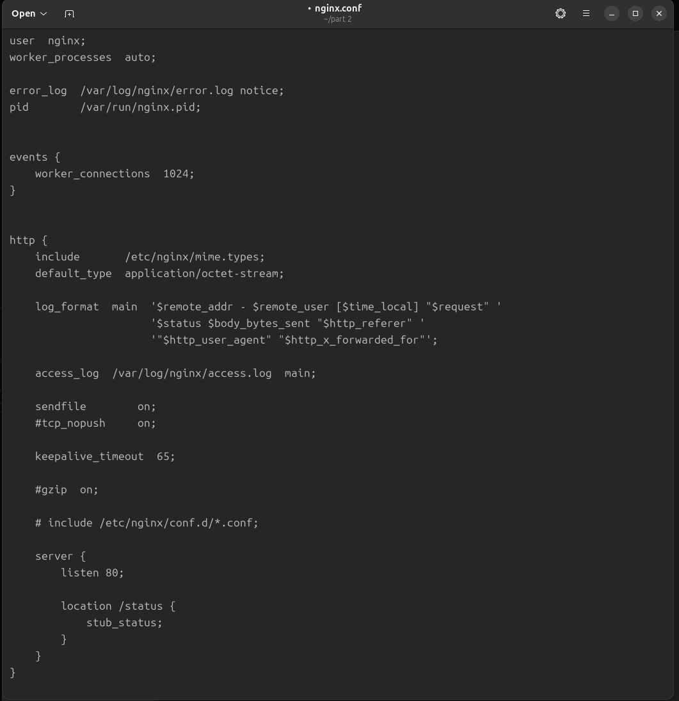
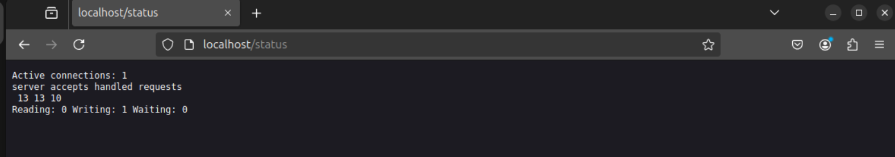

# **Simple Docker**  

  

> Все задания выполнял на вируальной машине **Ubuntu 24.04**. Виртуальная среда - **UTM**, архитектура процессора - **ARM64**. Короче тот еще гемморой, но все получилось.  


# Contents  
[Part 1. Готовый докер](#part-1-готовый-докер)  
[Part 2. Операции с контейнером](#part2-операции-с-контейнером)  
[Part 3. Мини веб-сервер](#part-3-мини-веб-сервер)  
[Part 4. Свой докер](#part-4-cвой-докер)  
[Part 5. Dockle](#part-5-dockle)  
[Part 6. Базовый Docker Compose](#part-6-базовый-docker-compose)  
[Полезные команды Docker](#полезные-команды-docker)  
[Полезные ссылки](#полезные-ссылки)  

## Part 1. Готовый докер  

<details>
<summary> == Подробное выполнение задани ==  </summary>

Возьми официальный докер-образ с nginx и выкачай его при помощи ```docker pull```.  
  
*Результат исполнения команды ```sudo docker pull ngins```*  

Проверь наличие докер-образа через ```docker images```.  
  
*Результат исполеннеия команды ```sudo docker images```*  

Запусти докер-образ через ```docker run -d [image_id|repository]```.  
  
*Результат исполнения команды ```sudo docker run -d nginx```* 
> ```sudo docker run -d --hepl``` -d, --detach - Run container in background and print container ID запуск образа в фоновом режиме   

Проверь, что образ запустился через docker ps.  
  
*Результат исполнения команды ```sudo docker ps```*  

Посмотри информацию о контейнере через docker inspect [container_id|container_name].  
  
*Результат исполнения команды ```sudo docker inspect musing_cori```*  
> используем NAMES, а не image  

По выводу команды определи и помести в отчёт размер контейнера, список замапленных портов и ip контейнера.  
Я сначала просмотрел вывод команды inspect, нашел похожие параменты и после воспользовался поиском с утилитой grep. Размер контейнера - 67108864, замапленный порт - 80, ip-адрес - 172.17.0.2.  
  
*Размер контейнера*  
  
*Замапленный порт*  
  
*IP адресс*  

Останови докер контейнер через docker stop [container_id|container_name].  
  
*Результат исполнения команды ```sudo docker stop musing_cori```*  

Проверь, что контейнер остановился через docker ps.  
  
*Результат исполнения команды ```sudo docker ps```*  

Запусти докер с портами 80 и 443 в контейнере, замапленными на такие же порты на локальной машине, через команду run.
> -d: Запускает контейнер в фоне, не блокируя терминал.
-p 80:80: Пробрасывает порт 80 на хост-машине к порту 80 внутри контейнера, позволяя доступ к сервисам контейнера через этот порт.  
  
*Результат исполнения команды ```sudo docker run -d -p 80:80 -p 443:443 nginx```*  

Проверь, что в браузере по адресу localhost:80 доступна стартовая страница nginx.
  
*Страница в браузеле localhost:80*  

Перезапусти докер контейнер через docker restart [container_id|container_name].  
  
*Результат исполнения команды ```sudo docker restart elated_lamport```*  
Проверь любым способом, что контейнер запустился - на картинке выше сначала командой ```sudo docker ps``` показываем запущенные контейнеры, потом ком
андой ```sudo docker restart elated_lamport``` перезапускаем контейнер с nginx и затем смтрим командой ````sudo docker ps```, что контейнер запущен.  
В отчёт помести скрины:
вызова и вывода всех использованных в этой части задания команд;
стартовой страницы nginx по адресу localhost:80 (адрес должен быть виден). 

</details>

<details>
<summary> ==  Результат краткий == </summary>

  
*Страница в браузере localhost:80*  

</details>


## Part 2. Операции с контейнером  

<details>
<summary> == Подробное выполнение задани ==  </summary>

> Задание переделаал после завершения его полностью.  


Прочитай конфигурационный файл nginx.conf внутри докер контейнера через команду exec.  
Создай на локальной машине файл nginx.conf.  
  
*Создал контейнер из образа nginx командой ```docker run -p 80:80 -p 443:443 -d nginx```.*  
  
*Прочитал сразу в файл на локальную машину конфигурационный файл командой ```docker exec goofy_euclid cat /etc/nginx/nginx.conf>>nginx.conf```*  

Настрой в нем по пути /status отдачу страницы статуса сервера nginx.  
  
*Содержание файла nginx.conf локальной машины после настройки*  

Скопируй созданный файл nginx.conf внутрь докер-образа через команду docker cp.  
  
*скопировал файл в контейнер командой ```docker cp nginx.conf goofy_euclid:/etc/nginx/nginx.conf```*  

Перезапусти nginx внутри докер-образа через команду exec. 
  
*Перезапустил nginx внутри контейнера команйо ```docker exec goofy_euclid nginx -s reload```*  

Проверь, что по адресу localhost:80/status отдается страничка со статусом сервера nginx.  
  
*Страница браузера по адресу localhost:80/status и localhost:80*  

Экспортируй контейнер в файл container.tar через команду export.  
  
*Результат исполнения команды ```docker export -o container.tar goofy_euclid```*  

Останови контейнер.  
  
*Остановил контейнер*  

Удали образ через docker rmi [image_id|repository], не удаляя перед этим контейнеры.  
  
*Удалил образ командой ```docker rmi -f nginx```*  
> Без флага -f удаление невозможно, пока существует контейнер, созданный из этого образа, хоть этот контейнер и остановлен. -f - это Принудительное удаление образа. При таком удалении остановленный контейнер еще существует.  

Удали остановленный контейнер.  
  
*Удалил остановленный контейнер*  

Импортируй контейнер обратно через команду import.  
  
*Импортировал образ обратно командой ```sudo docker import --change 'CMD ["nginx", "-g", "daemon off;"]' container.tar my_nginx```*  

Запусти импортированный контейнер.  
  
*Запустил контейнер командой ```sudo docker run -p 80:80 -p 443:443 -d my_nginx```*  

Проверь, что по адресу localhost:80/status отдается страничка со статусом сервера nginx.  
  
  
*Страница браузера по адресу localhost:80 и localhost:80/status*  

В отчёт помести скрины:  
вызова и вывода всех использованных в этой части задания команд;  
содержимое созданного файла nginx.conf;  
страницы со статусом сервера nginx по адресу localhost:80/status.  

</details>

<details>
<summary> ==  Результат краткий == </summary>

  
  
*Страница браузера по адресу localhost:80 и localhost:80/status*  

</details>


## Part 3. Мини веб-сервер  

<details>
<summary> == Подробное выполнение задани == </summary>

Напиши мини-сервер на C и FastCgi, который будет возвращать простейшую страничку с надписью Hello World!.  
Для исполнения этой части посмотрел видео тут https://www.youtube.com/watch?v=dAvW3bQdXg8 и в materials файл mini_server.md. Еще очень полезное вот тут про Fastgiapp.h https://habr.com/ru/articles/154187/ .  
Установил на виртуальную линукс-машину libfcgi-dev и nginx командой ```sudo apt-get install libfcgi-dev nginx```.  

  
*Написал мини-сервер на СИ. Все компилирется без ошибок*  

Запусти написанный мини-сервер через spawn-fcgi на порту 8080.  
Для азпуска установил spawn-fcgi командой ```sudo apt-get install spawn-fcgi```.  
Затем запустил в докере на 81 порту nginx командой ```sudo docker run -d -p 81:81 nginx```  
  
*Запущенный на 81 порту nginx*  
Затем в контейнер копируем наш мини-сервер на СИ командой ```sudo docker cp mini_server_c.c great_chebyshev:/etc/nginx/```.  
Далее заходим в терминал запущенного контейнера nginx командой ```sudo docker exec -it 211f61a39702 bash``` и устанавливаем gcc, spawn-fcgi и libfcgi-dev (команды ```apt install <name>```).   
  
*Зашли в терминал контейнера nginx*  
Находясь в терминале контейнера nginx компилируем исполняемый файл нашего сервера.  
  
*Скомпилировал исполнемый файл  a.out и запустил мини-сервер через spawn-fcgi командой ```spawn-fcgi -p 8080 a.out```*  
Напиши свой nginx.conf, который будет проксировать все запросы с 81 порта на 127.0.0.1:8080.  
Проверил что в файле nginx.conf настройки сервера есть, не стал отдельно прописывать, сделал как в части 2 (соханил на локальную машину и потом через cp закинул в контейнер).  
  
*Файл nginx.conf в контейнере nginx*  

Проверь, что в браузере по localhost:81 отдается написанная тобой страничка.  
  
*Страница в браузере по адресу localhost:81*  

</details>

<details>
<summary> ==  Результат краткий == </summary>

  
*Страница в браузере по адресу localhost:81*  

</details>


## Part 4. Свой докер  

<details>
<summary> == Подроное выполнение задания == </summary>

При написании докер-образа избегай множественных вызовов команд RUN  
Напиши свой докер-образ, который:  
1) собирает исходники мини сервера на FastCgi из Части 3;  
2) запускает его на 8080 порту;  
3) копирует внутрь образа написанный ./nginx/nginx.conf;  
4) запускает nginx.  
nginx можно установить внутрь докера самостоятельно, а можно воспользоваться готовым образом с nginx'ом, как базовым. 

Написал докерфайл и файлы к нему. Файлы - два скрипта, один для усатновки всего необходимо для работы мини-сервера на си, второй для компиляции и запуска мини-сервера на си. Сам докер сначала копирует файлы скриптов, мини-сервер и файл конфигурациии nginx в образ, затем при первом запуске выполнит скрипт по кстановке всего, и затем при каждом запуке ьулет выполнять скрипт старт. Мини-сервер и файл конфигурации из раздела 3.  
  
*Содержание докерфайла*  
  
  
*Содержание скриптов install_all и start*  

Собери написанный докер-образ через docker build при этом указав имя и тег.  
  
*Собрал докер-образ через команду ```sudo docker build --tag nginx_frostdra:1.0 .```*  

Проверь через docker images, что все собралось корректно.  
  
*Наличие нового образа проверил командой ```sudo docker images```*  

Запусти собранный докер-образ с маппингом 81 порта на 80 на локальной машине и маппингом папки ./nginx внутрь контейнера по адресу, где лежат конфигурационные файлы nginx'а (см. Часть 2).  
  
*Запустил образ командой ```sudo docker run -p 80:81 -v /home/valerasomov/part\ 4/nginx.conf:/etc/nginx/nginx.conf -d nginx_frostdra:1.0```*  
  
*Проверил, что контейнер запущен командой ```sudo docker ps```*  

Проверь, что по localhost:80 доступна страничка написанного мини сервера.  
  
*Страница в браузере по адресу localhost:80*  

Допиши в ./nginx/nginx.conf проксирование странички /status, по которой надо отдавать статус сервера nginx.  
  
*Изменный nginx.conf*  

Перезапусти докер-образ.  
  
*Перезапустил докер-кронтейнер командой ```sudo docker restart vigilant_haibt```*  

Если всё сделано верно, то, после сохранения файла и перезапуска контейнера, конфигурационный файл внутри докер-образа должен обновиться самостоятельно без лишних действий.  
Зашел в контейнер командой ```sudo docker exec -it 6389cc9202b2 bash``` и прочитал конфигурационный файл ```cat /etc/nginx/nginx.conf ```
  
*Содержание файла nginx.conf*  

Проверь, что теперь по localhost:80/status отдается страничка со статусом nginx.  
  
*Страница в браузере по адресу localhost.status*  

</details>

<details>
<summary> ==  Результат краткий == </summary>

  
*Страница в браузере по адресу localhost.status*   

</details>


## Part 5. Dockle  

<details>
<summary> == Подробное выполнение задани == </summary>


Просканируй образ из предыдущего задания через dockle [image_id|repository].  
Исправь образ так, чтобы при проверке через dockle не было ошибок и предупреждений.  
Установил dockle. Для m-процессора архитектуры ARM64 скачал deb последней версии отсюда - https://sourceforge.net/projects/dockle.mirror/files/v0.4.14/.  
Затем командой ```sudo dpkg -i dockle_0.4.14_Linux-ARM64.deb && rm dockle_0.4.14_Linux-ARM64.deb``` установил.  
  
*Процесс установки dockle*  

  
*Проверка образа dockle ну такое себе))*  
Я проверил родительский образ nginx и увидел туже ошибку.  
  
*Проверка образа nginx dockle*  

**Проблема ```FATAL	- CIS-DI-0010```**  
Для решения проблемы ```FATAL	- CIS-DI-0010``` прочитал тут https://github.com/goodwithtech/dockle/issues/130 и использовал команду с ```dockle --accept-key NGINX_GPGKEYS --accept-key NGINX_GPGKEY_PATH nginx_frostdra:1.0```, которая позволяет подтвердить использование конкретных ключей для работы нашего nginx сервера.  

**Проблема ```WARN	- CIS-DI-0001```**  
Для решения проблемы ```WARN	- CIS-DI-0001``` прочитал тут https://www.thorsten-hans.com/lint-docker-images-with-dockle/ и долго мучился, многократно еперзапуская. По итогу пришлось изменить nginx.conf - ```pid /home/dockle/nginx.pid;``` и внести изменения в Dockerfile
```
# Создание непривилегированного пользователя и выдача прав на использование директории
RUN useradd -d /etc/nginx/ -m -s /bin/bash dockle && \
    chown -R dockle:dockle /etc/nginx/ && \
    chown -R dockle:dockle /var/cache/nginx && \
    chown -R dockle:dockle /var/run && \
    mkdir -p /home/dockle/ && \
    chown dockle:dockle /home/dockle
.
.
.
# Переключаемся на пользователя dockle
USER dockle

# каждый запуск - компилируем и запускаем мини сервер
CMD ["sh", "/etc/nginx/start.sh"]
```  

**Проблема ```INFO	- CIS-DI-0006```**  
Далее для решения проблемы ```INFO	- CIS-DI-0006``` прочитал тут https://www.thorsten-hans.com/lint-docker-images-with-dockle/ и внес изменения в Dockerfile.  
Добавил
```
HEALTHCHECK --interval=30s --timeout=2s --start-period=5s --retries=3 CMD curl -f http://localhost:8080 || exit 1
```  

**Проблема ```INFO	- CIS-DI-0005```**  
Для решения проблемы ```INFO	- CIS-DI-0005``` прочитал все еще тут https://www.thorsten-hans.com/lint-docker-images-with-dockle/ использовал команду ```export DOCKER_CONTENT_TRUST=1```.  
Для решения проблемы ```INFO	- CIS-DI-0008``` прочитал тут https://githubissues.com/runatlantis/atlantis/3789 и добавил в скрипт install_all.sh
```
chmod u-s /usr/bin/newgrp /usr/bin/chsh /usr/bin/gpasswd /usr/bin/passwd /usr/bin/su usr/bin/umount usr/bin/chfn usr/bin/mount
chmod g-s /usr/bin/chage /usr/sbin/unix_chkpwd usr/bin/expiry
```  

  
  
  
*Изменный Dockerfile, nginx.conf и скрипт install_all.sh*  

Затем собрал новый образ командой ```docker build --tag nginx_frostdra:1.1 .``` и проверил этот образ командой ```dockle --accept-key NGINX_GPGKEYS --accept-key NGINX_GPGKEY_PATH nginx_frostdra:1.1```.  

Результат выполнения.  
  
*Результат исполнения команд ```docker build --tag nginx_frostdra:1.1 .``` и ```dockle --accept-key NGINX_GPGKEYS --accept-key NGINX_GPGKEY_PATH nginx_frostdra:1.1```*  
В целях итоговой проверки, что все работает как и раньше запустил новый контейнер из образа с версией 1.1 и проверил страницы в браузере, аналогичные п. 4. 
  
*Страницы в браузере localhost:80 и localhost/status*  

</details>


<details>
<summary> ==  Результат краткий == </summary>

  
*Страницы в браузере localhost:80 и localhost/status*  

</details>


## Part 6. Базовый Docker Compose  
<details>
<summary>== Подробное выполнение задани == </summary>

Напиши файл docker-compose.yml, с помощью которого:  
1) Подними докер-контейнер из Части 5 (он должен работать в локальной сети, т. е. не нужно использовать инструкцию EXPOSE и мапить порты на локальную машину).  
2) Подними докер-контейнер с nginx, который будет проксировать все запросы с 8080 порта на 81 порт первого контейнера.  
  
*Написал такой docker-compose.yml*  

Замапь 8080 порт второго контейнера на 80 порт локальной машины.  
  
*Для мапинга 8080 порта второго с 80 порта локальной машины прописал это в nginx.conf*  
Останови все запущенные контейнеры.  
  
*Остановил все запущенные контейнеры*  
Собери и запусти проект с помощью команд docker-compose build и docker-compose up.  
  
*Собрал и запустил проект*  
Проверь, что в браузере по localhost:80 отдается написанная тобой страничка, как и ранее. 
  
*Страница в браузере localhost:80 и запущенный контейнер*  

</details>

<details>
<summary> ==  Результат краткий == </summary>

Результат выполенения.  
В целях итоговой проверки, что все работает проверил, что контейрнер запущен и открыл страницу в браузере localhost:80.  
  
*Страница в браузере localhost:80 и запущенный контейнер*  

</details>


## Полезные команды Docker и инструкции Dockerfile  
<details>
<summary>Раскрыть</summary>

**Команды Docker**

|Команда|Фукнционал|
|--------|---------|
|docker images|Выводит информацию об образах|
|docker rmi id_контейнера\имя-контейнера|Удаление образа|
|docker ps|Список всех доступных запущенных контейнеров|
|docker ps -a|Список всех доступных контейнеров (остановленные контейнеры)|
|docker stop id_контейнера\имя_контейнера|Остановить контейнер. id_контейнера можно несколько и модно писать частично. Например docker stop a8 b34 vfff|
|docker start id_контейнера\имя_контейнера|Запуск контейнера|
|docker pause id_контейнера\имя_контейнера|Пауза в работе контейнера|
|docker unpause id_контейнера\имя_контейнера|Снятие контейнера с паузы|
|docker pull имя_образа|Скачать нужный образ|
|docker exec -it id_контейнера\имя_контейнера bash|Подключиться к запущенному контейнеру и запустить в нем терминал. По-умолчанию с правами root. Выйти - exit.|
|docker cp <SRC> <DEST>|Копирует файл src из локальной машины в директорию контейра dest. Например, docker cp /tmp/config.ini grafana:/usr/share/grafana/conf/|
|docker image inspect|Вывод подробной информации об образе, включая сведения о слоях|
|docker image --tag|Создание тега (названия) для контейнера при запуске|

**Инструкции Dockerfile**
|Инструкция|Описание|
|----------|---------|
|FROM|Задаёт базовый (родительский) образ.|
|LABEL|Описывает метаданные. Например, содержит сведения о создателе и поддерживающем образ.|
|ENV|Устанавливает постоянные переменные среды.|
|RUN|Выполняет команду и создаёт слой образа. Используется для установки в контейнер пакетов.|
|COPY|Копирует файлы и папки в контейнер.|
|ADD|Копирует файлы и папки в контейнер и может распаковывать локальные .tar-файлы.|
|CMD|Описывает команду с аргументами, которую нужно выполнить при запуске контейнера. В файле может присутствовать лишь одна инструкция CMD.|
|WORKDIR|Задаёт рабочую директорию для следующей инструкции.|
|ARG|Задаёт переменные для передачи Docker во время сборки образа.|
|ENTRYPOINT|Предоставляет команду с аргументами для вызова во время выполнения контейнера. Аргументы не переопределяются.|
|EXPOSE|Указывает на необходимость открыть порт.|
|VOLUME|Создаёт точку монтирования для работы с постоянным хранилищем.|


</details>

## Полезные ссылки  
<details>
<summary>Раскрыть</summary>

1. https://www.youtube.com/watch?v=O8N1lvkIjig&t=2563s - супер видео 5 часов про докер.  
2. https://youtu.be/dNS61T4MmlM?si=Pqyd1bsqFrcFMMnK - отличные уроки по докеру.  
3. https://nginx.org/ru/docs/beginners_guide.html - туториал по nginx на русском языке. 
4. https://skillbox.ru/media/code/server-nginx-kak-on-rabotaet-i-kak-ego-nastroit/ - раздел "Иерархия каталогов Nginx" для 5 части с пользователем без рут.
5. https://skillbox.ru/media/code/server-nginx-kak-on-rabotaet-i-kak-ego-nastroit/ - для настройки конфигурационного файла nginx.conf.
6. https://www.youtube.com/watch?v=dAvW3bQdXg8 - мини-сервер на СИ. 
7. https://github.com/docker/compose/blob/v1/docs/Compose%20file%20reference%20(legacy)/version-3.md версию compose file format определеял тут.


</details>

  
*На самом деле без интернета и chatgpt нет, но картинка прикольная*  