# **Basic CI/CD**

    

**CI** упаковывает, тестирует сборки и оповещает разработчиков, если что-то пошло не так.  
**CD** автоматически разворачивает приложения и выполняет дополнительные тесты.  


# **Contents**
[**Part 1. Настройка gitlab-runner**](#part-1-настройка-gitlab-runner)  
[**Part 2. Сборка**](#part-2-сборка)  
[**Part 3. Тест кодстайла**](#part-3-тест-кодстайла)  
[**Part 4. Интеграционные тесты**](#part-4-интеграционные-тесты)  
[**Part 5. Этап деплоя**](#part-5-этап-деплоя)  
[**Part 6. Дополнительно. Уведомления**](#part-6-дополнительно-уведомления)  
[*Вместо многих слов...*](#вместо-многих-слов)  
[*Полезные ссылки*](#полезные-ссылки)  


## **Part 1. Настройка gitlab-runner**  

<details>
<summary> == Подробное выполнение задания == </summary>

**== Задание ==**
> Подними виртуальную машину Ubuntu Server 22.04 LTS.  
Будь готов, что в конце проекта нужно будет сохранить дамп образа виртуальной машины.  
Скачай и установи на виртуальную машину gitlab-runner.  
Запусти gitlab-runner и зарегистрируй его для использования в текущем проекте (DO6_CICD).  
Для регистрации понадобятся URL и токен, которые можно получить на страничке задания на платформе. 


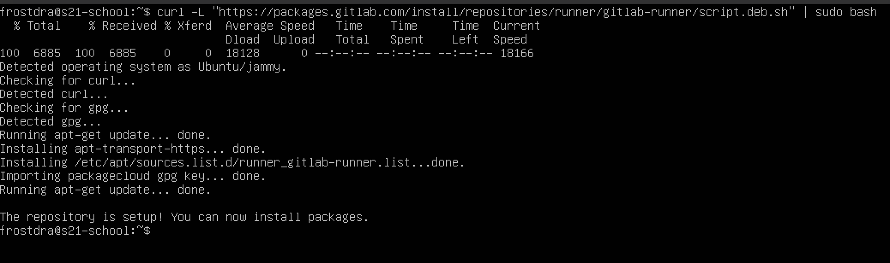  
*Поднял ubuntu 22.04.4 live server на UTM*  
> Образ ubuntu-22.04.4-live-server-arm64.iso взял с официального сайта https://cdimage.ubuntu.com/releases/22.04/release/  

  
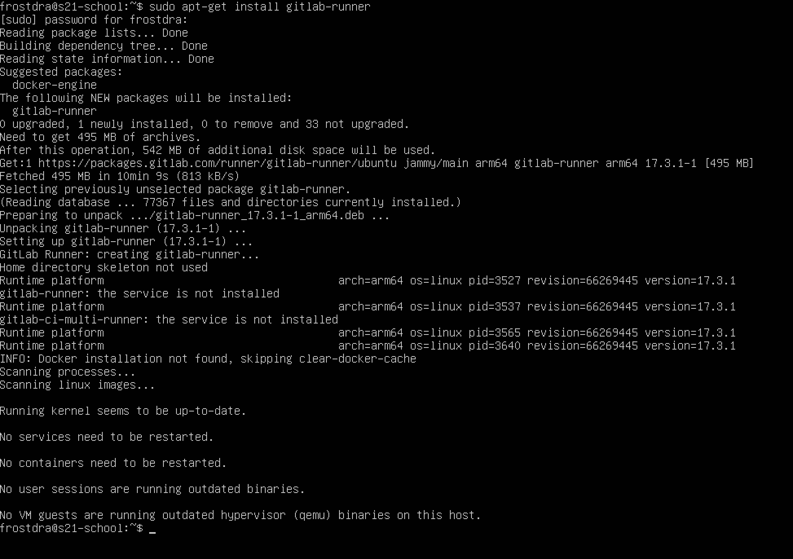  
*Скачал официальный репозиторий и установил из него gitlab-runner*  
> Скачать репозиторий - ```curl -L "https://packages.gitlab.com/install/repositories/runner/gitlab-runner/script.deb.sh" | sudo bash``` 
> Установить gitlab-runner - ```sudo apt-get install gitlab-runner```  

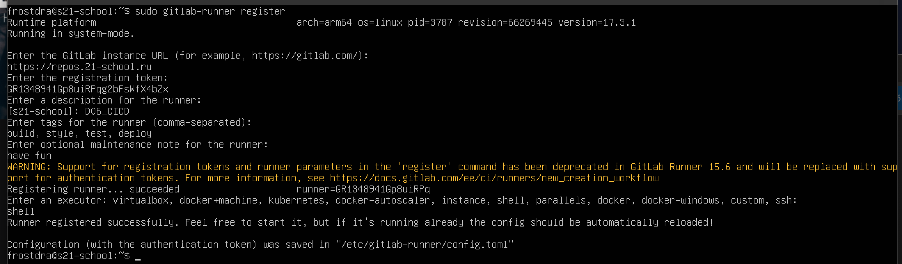  
*Регистрация в gitlab-runner*  
> Регистрировал по мануалу https://docs.gitlab.com/runner/register/index.html раздела Register with a runner registration token (deprecated).  
URL, token взял с соответвующего раздела edu, description (описание) - название проекта, maintenance - ради шутки, executot - shell. Почему шелл в последнем? Я сначала сделал виртуалбокс, получилась фигня, потом прочитал в телеге и сделал шелл. Всего при регистрации было заведено 4 тега: build, style, test, deploy.  

Поскольку вся проверка будет "крутиться" на сервере установил gcc, make, valgrind командами ```sudo apt-get install gcc```, ```sudo apt-get install make```, ```sudo apt-get install valgrind```.  

</details>

<details>
<summary> == Результат краткий == </summary>

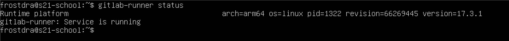  
*Результат установки, регистрации и запуска gitlab-runner*  
</details>

<details>
<summary> == Критичные моменты == </summary>

1. Если хочешь сохранить возможности копи-паста и чуть меньше геммороится, то подключайся к серверу через терминал мак (ну и что под рукой будет) по ssh <name>@<ip_внешний_сервака>. Может нужно будет что-то установить, не помню уже.  

  
</details>


## **Part 2. Сборка**  

<details>
<summary> == Подробное выполнение задания == </summary>
    
**== Задание ==**     
Напиши этап для CI по сборке приложений из проекта C2_SimpleBashUtils.  
В файле gitlab-ci.yml добавь этап запуска сборки через мейк файл из проекта C2.  
Файлы, полученные после сборки (артефакты), сохрани в произвольную директорию со сроком хранения 30 дней.  
Скопировал свой проект SimpleBash в папку текущего проекта и написал файл yml. Файл gitlab-ci.yml располагается в корневой папке проекта.  

Размещение папок и критичный файлов в каталоге проекта.   
```
D06_CICD-1  
└───code-simple  
|   |files  
└───data-samples  
|   |files  
└───datasets  
|   |files  
└───materials  
|   |files  
└───misc  
|   |files  
└───src  
|   └───cat  
|   |   |files  
|   └───grep  
|       |files  
|gitlab-ci.yml  
|... 
```

Файл gitlab-ci.yml  
```
stages:
  - build 

build_job_cat_ci:
  stage: build
  tags: 
    - build
  script:
    - echo "s21_CAT build is running"
    - cd src/cat/ && make
  artifacts:
    paths:
      - src/cat/
    expire_in: 30 days

build_job_grep_ci:
  stage: build
  tags: 
    - build
  script:
    - echo "s21_GREP build is running"
    - cd src/grep/ && make
  artifacts:
    paths:
      - src/grep/
    expire_in: 30 days
```  

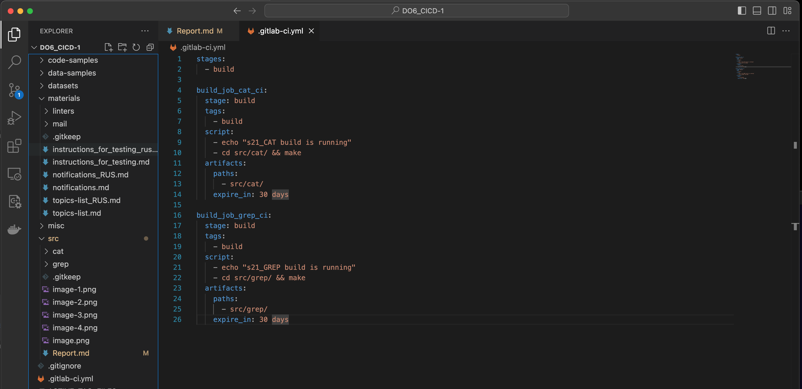  
*Написал файл gitlab-ci.yml*  

</details>

<details>
<summary> == Результат краткий == </summary>
В результате при push репозитория проводится проверка на сборку исполняемого файла в папке cat и grep через Makefile.  

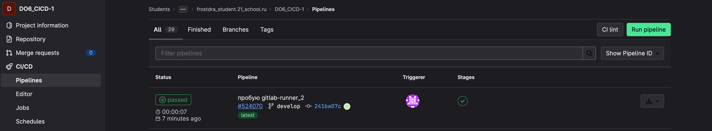  
*В разделе CICD/Pipelines*  

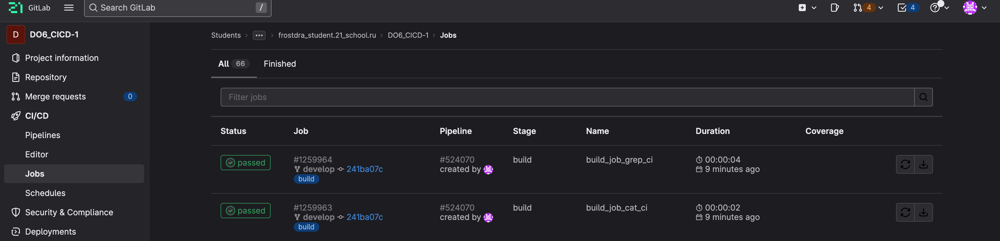  
*Каждый раздел stage отдельно в раздее CICD/jobs*  

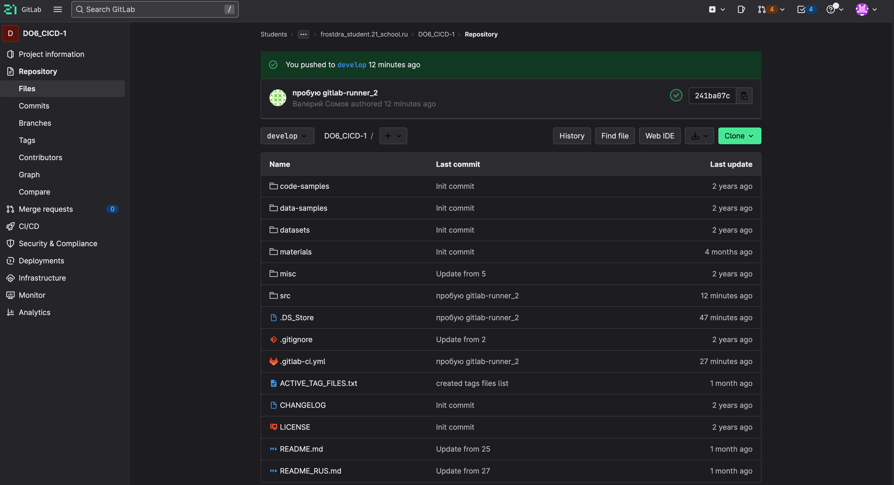  
*Кратко результат отбработки runner оборжается под каждым коомитом*  

</details>


<details>
<summary> == Критичные моменты == </summary>

1. Внимательно прописывать путь к файлам. Старт - каталог размещения файла gitlab-ci.yml.  
2. Версия gcc на сервере 11.4.0, на локальной машине 15.0.0. и флаг -Werror отрабатывается по-разному. Пришлось вносить изменения в код:  

|Наименование файла и функции|Было|Стало|
|------------------|-------|--------|
|cat.c - applying_flags|char now_c, previos_c = '\n';|int now_c = 1; char previos_c = '\n';|
|grep.c - print_flag_to_print|if (temp[strlen(temp)] == EOF)|if (feof(stdin))|

  
</details>


## **Part 3. Тест кодстайла**  

<details>
<summary> == Подробное выполнение задания == </summary>

**== Задание ==**  
Напиши этап для CI, который запускает скрипт кодстайла (clang-format).  
Если кодстайл не прошел, то «зафейли» пайплайн.  
В пайплайне отобрази вывод утилиты clang-format.  

Установил clang на сервер командой ```sudo apt-get install clang-format``` и акцептовал ну или с флагом ```-y``` делать.  

В файл gitlab-ci.yml внес этап style.  
> Можно было бы разбить на два теста для cat и grep отдельн, я специально сделал в одном попробовать, чтобы и раздельные этапы были и общий.  
```
code_style_ci:
  stage: style
  tags:
    - style
  script:
    - echo "clang-format check is running"
    - cp materials/linters/.clang-format .

    - cd src/cat/ && clang-format -n *.c *.h 2>&1 | tee cat_format_check_result.txt
    - if [ -s cat_format_check_result.txt ]; then echo "cat.c format FAIL" && exit 1; else echo "cat.c format is good"; fi
    - rm -rf cat_format_check_result.txt

    - cd src/grep/ && clang-format -n *.c *.h 2>&1 | tee grep_format_check_result.txt
    - if [ -s grep_format_check_result.txt ]; then echo "grep.c format FAIL" && exit 1; else echo "grep.c format is good"; fi
    - rm -rf grep_format_check_result.txt
    
    - rm -rf .clang-format
```  

> Вот тут  подглядел https://stackoverflow.com/questions/9964823/how-to-check-if-a-file-is-empty-in-bash  

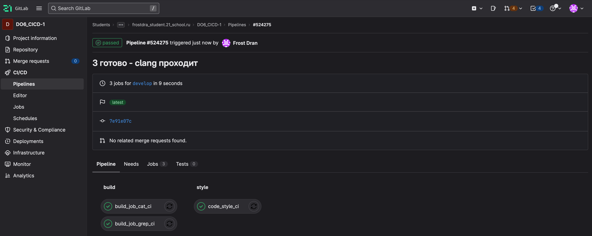  
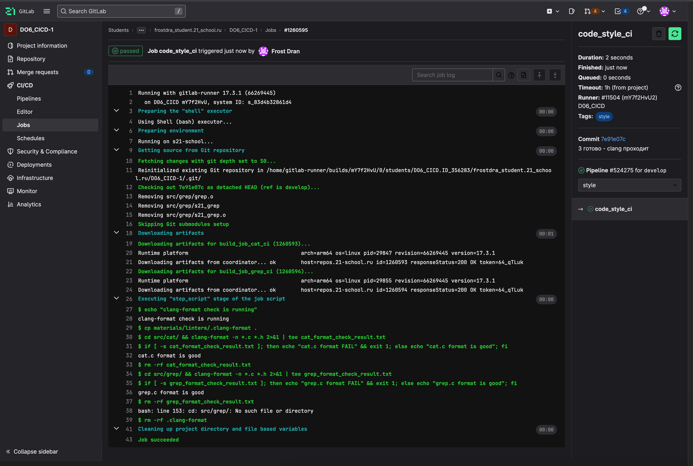  
*Отображение вывода утилиты clang реализовал через вывод на экран результата (если файл пустой - все ОК, иначе - нет)*  

Сделал еще, чтобы clang-format не прошел.  
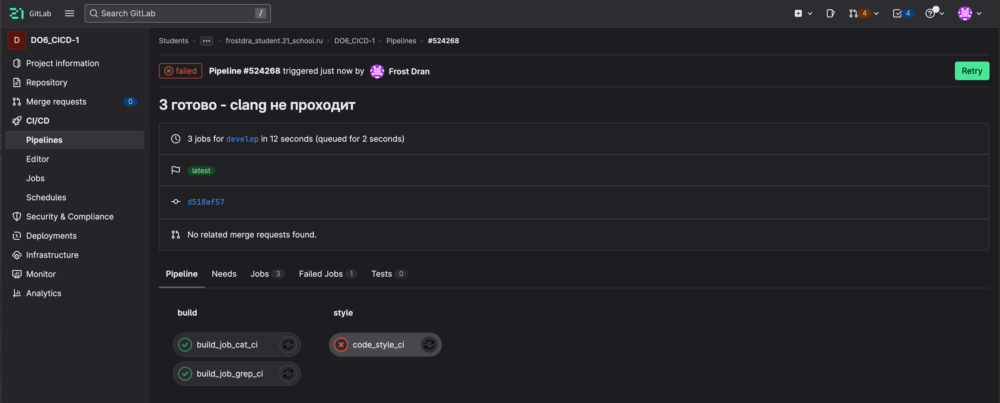  
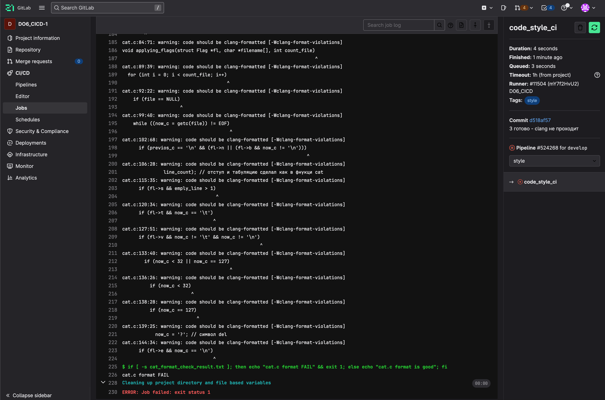  
*Ошибка в формате - не проходит Pipelines*  

>БОНУС - раздельный этап проверки на формат вот такой:  
```
code_style_cat_ci:
  stage: style
  tags:
    - style
  script:
    - echo "clang-format CAT check is running"
    - cp materials/linters/.clang-format .

    - cd src/cat/ && clang-format -n *.c *.h 2>&1 | tee cat_format_check_result.txt
    - if [ -s cat_format_check_result.txt ]; then echo "cat.c format FAIL" && exit 1; else echo "cat.c format is good"; fi
    - rm -rf cat_format_check_result.txt

code_style_grep_ci:
  stage: style
  tags:
    - style
  script:
    - echo "clang-format GREP check is running"

    - cd src/grep/ && clang-format -n *.c *.h 2>&1 | tee grep_format_check_result.txt
    - if [ -s grep_format_check_result.txt ]; then echo "grep.c format FAIL" && exit 1; else echo "grep.c format is good"; fi
    - rm -rf grep_format_check_result.txt

    - rm -rf .clang-format
```

</details>


<details>
<summary> == Результат краткий == </summary>

  
  
*clang-format проходит*  

Сделал еще, чтобы clang-format не прошел.  
  
  
*clang-format не проходит*  

</details>


## **Part 4. Интеграционные тесты**  

<details>
<summary> == Подробное выполнение задания == </summary>

**== Задание ==**  
Напиши этап для CI, который запускает твои интеграционные тесты из того же проекта.  
Запусти этот этап автоматически только при условии, если сборка и тест кодстайла прошли успешно.  
Если тесты не прошли, то «зафейли» пайплайн.  
В пайплайне отобрази вывод, что интеграционные тесты успешно прошли / провалились.  

В файл gitlab-ci.yml внес этап style для cat и grep.  
```
tests_cat:
  stage: test
  tags: 
    - test
  script:
    - echo "tests bash-script CAT is running"
    
    - cd src/cat/ && bash ./test_func_cat.sh 2>&1 | tee cat_test_result.txt
    - if grep -q "FAIL:\ 0" cat_test_result.txt; then echo "cat.c test is good"; else echo "cat.c test FAIL" && exit 1; fi
    - rm -rf cat_test_result.txt

  dependencies:
    - build_job_cat_ci
    - code_style_ci

tests_grep:
  stage: test
  tags: 
    - test
  script:
    - echo "tests bash-script GREP is running"

    - cd src/grep/ && bash ./test_func_grep.sh 2>&1 | tee grep_test_result.txt
    - if grep -q "FAIL:\ 0" grep_test_result.txt; then echo "grep.c test is good"; else echo "grep.c test FAIL" && exit 1; fi
    - rm -rf grep_test_result.txt
  dependencies:
    - build_job_grep_ci
    - code_style_ci
```  
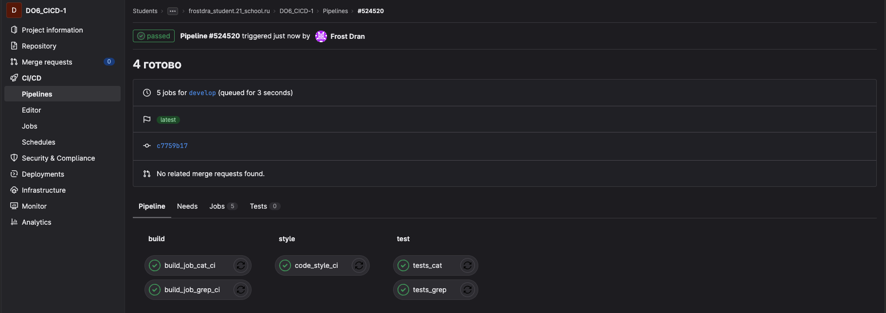  
*Тесты проходят*  

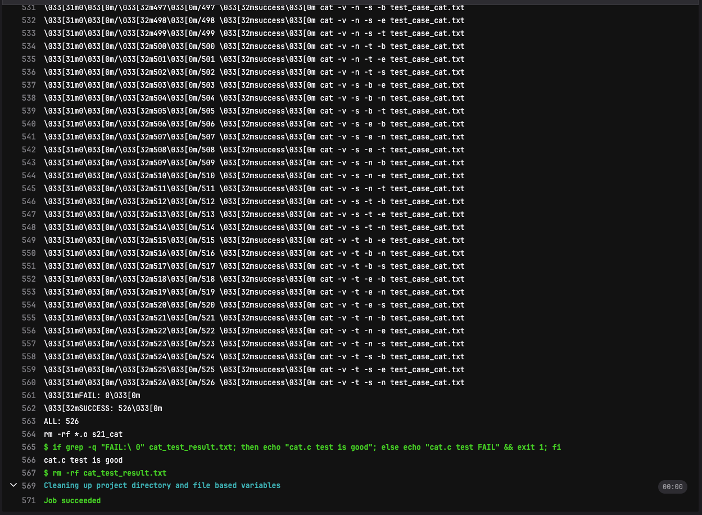  
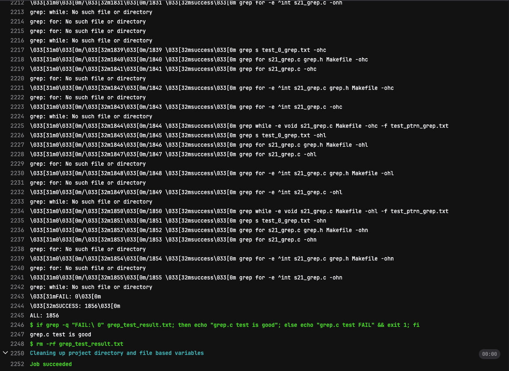  
*Отображение вывода результатов теста реализовал через вывод на экран конечного результата (если в файле есть строка "FAIL: 0" - все ОК, иначе - нет)*  


</details>

<details>
<summary> == Результат краткий == </summary>

  
*Тесты проходят*  

  
 попробовать")  
*Отображение вывода результатов теста реализовал через вывод на экран конечного результата (если в файле есть строка "FAIL: 0" - все ОК, иначе - нет)*  

</details>

<details>
<summary> == Критичные моменты == </summary>

1. Для запуска sh-скрипта используем команду bash ./.., а не sh ./...  
2. Поиск грепом наличия в файле строки "FAIL: 0" не пропускает, потому ':' - добиваем 'слеш'

  
</details>

## **Part 5. Этап деплоя**  

<details>
<summary> == Подробное выполнение задания == </summary>

**== Задание ==**  
Подними вторую виртуальную машину Ubuntu Server 22.04 LTS.  

Поднял второй сервер путем клонирования первого.  

Настроил сеть статически ip-адресами 10.10.64.1 и 10.10.64.2 и проверил ping.  
server - две сети: хост-сеть - 10.10.0.0/8 и сеть с мостом (для внешнего взаимоействия). server 2 - одна сеть-хост - 10.10.0.0/8. У сервера 2 изменил mac-адрес сетевой карты.  
Пришлось установить openvswitch-switch - ```sudo apt install openvswitch-switch``` - иначе не мог применить изменения к netplan.  

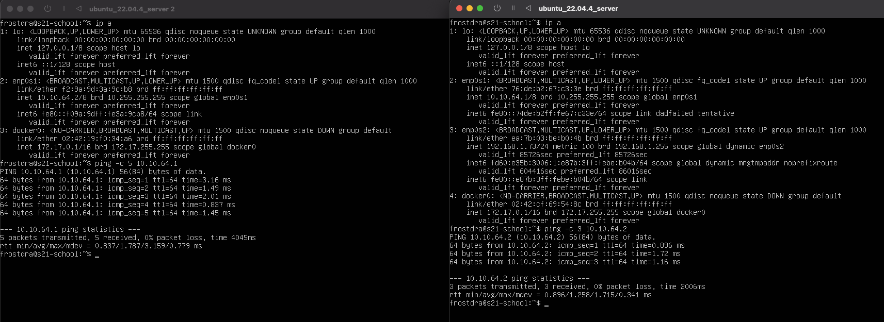  
*Статические адреса и результаты взаимных ping*  
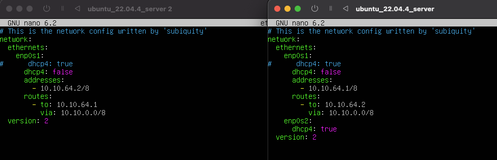  
*Файлы кнофигурации сети server и server 2*  

На server 2 изменил имя хоста, чтобы не перепутать. Команды ```sudo nano /etc/hostname``` ```sudo nano /etc/hosts``` и поправил файлы, теперь хост server - s21-school, хост server 2 - s21-school2.  
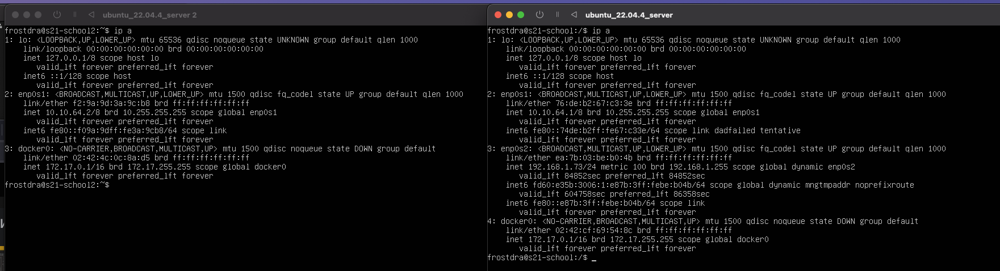  
*Обновленное имя хоста server 2*  

Напиши этап для CD, который «разворачивает» проект на другой виртуальной машине.  
Запусти этот этап вручную при условии, что все предыдущие этапы прошли успешно.  
Напиши bash-скрипт, который при помощи ssh и scp копирует файлы, полученные после сборки (артефакты), в директорию /usr/local/bin второй виртуальной машины.  
Тут тебе могут помочь знания, полученные в проекте DO2_LinuxNetwork.  
Будь готов объяснить по скрипту, как происходит перенос.  
В файле gitlab-ci.yml добавь этап запуска написанного скрипта.  
В случае ошибки «зафейли» пайплайн.  

Подготовительные действия:  
- ```sudo su gitlab-runner``` Сначала на server сменил пользвоателя на gitlab-runner, т.к. все действия производятся по этому имени (проверил в скрипте)  
- ```ssh-keygen``` Сгенерил ssh-ключ для пользователя gitlab-runner.  
- ```ssh-copy-id frostdra@10.10.64.2``` Скопировал ключ на server 2.  
- ```sudo usermod -aG sudo gitlab-runner``` Дал gitlab-runner больше прав на server 2.  
- ```sudo chmod 777 /user/local/bin``` На server 2 разрешил все делать с папкой user/local/bin.  

В скрипте отразил следующее:
```
#!/bin/bash

# whoami # определил пользователя - gitlab-runner
# ls

#копируем s21_cat
echo "______COPY s21_cat START______"
scp cat/s21_cat frostdra@10.10.64.2:/usr/local/bin

#копируем s21_grep
echo "______COPY s21_grep START______"
scp grep/s21_grep frostdra@10.10.64.2:/usr/local/bin

#проверяем наличие файлов на сервере 1
if ssh frostdra@10.10.64.2 "[ -f /usr/local/bin/s21_cat ]"; then echo "s21_cat at server 2"; else echo "s21_cat NOT at server 2. FAIL" && exit 1; fi
if ssh frostdra@10.10.64.2 "[ -f /usr/local/bin/s21_grep ]"; then echo "s21_grep at server 2"; else echo "s21_grep NOT at server 2. FAIL" && exit 1; fi
```  
> пояснения
scp cat/s21_cat frostdra@10.10.64.2:/usr/local/bin - копирование самого файла  
if ssh frostdra@10.10.64.2 "[ -f /usr/local/bin/s21_cat ]"; - проверка наличия файла.

В файл gitlab-ci.yml добавил этап deploy.  
```
deployment_cd:
  stage: deploy
  tags:
    - deploy
  script:
    - cd src && bash ./script_copy_to_server_2.sh
  dependencies:
    - build_job_cat_ci
    - build_job_grep_ci
    - code_style_ci
    - tests_cat
    - tests_grep
  when: manual
```  

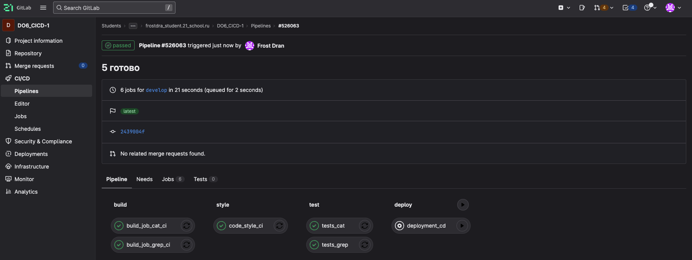  
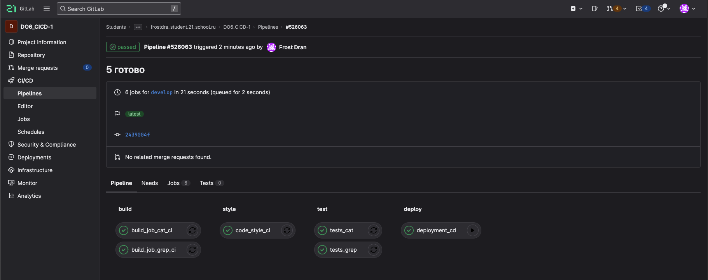  
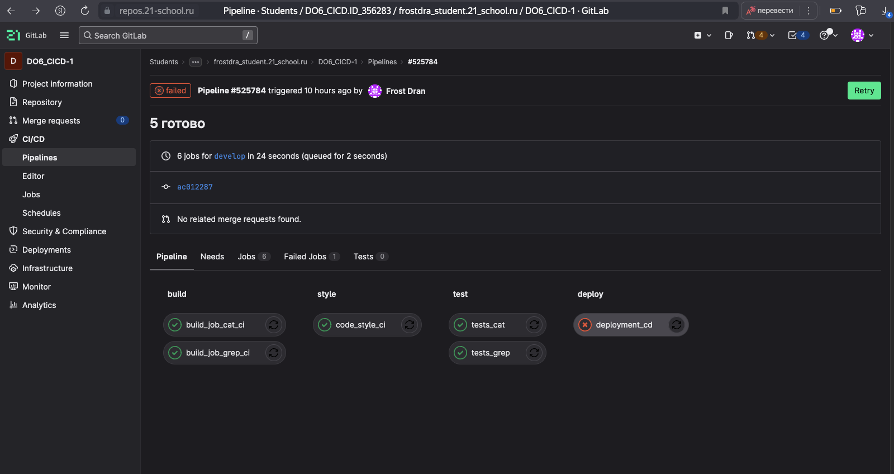  
*Исполнение gitlab-ci.yml в том числе зафейленный вариант*  

В результате ты должен получить готовые к работе приложения из проекта C2_SimpleBashUtils (s21_cat и s21_grep) на второй виртуальной машине.  
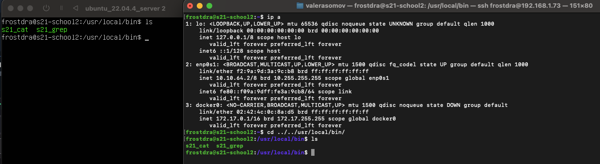  
*Наличие исполняемых файлов s21_cat и s21_grep на server 2*  

Сохрани дампы образов виртуальных машин.  
P.S. Ни в коем случае не сохраняй дампы в гит!  

Не забудь запустить пайплайн с последним коммитом в репозитории.  

</details>

<details>
<summary> == Результат краткий == </summary>

  
  
*Исполнение gitlab-ci.yml*  

  
*Наличие исполняемых файлов s21_cat и s21_grep на server 2*  

</details>

<details>
<summary> == Критичные моменты == </summary>

1. НЕ ЗАБУДЬ ПЕРЕЙТИ НА ПОЛЬЗОВАТЕЛЯ gitlab-runner на server при генерации ключа. Все что CICD делает он делает от пользователя gitlab-runner.  
2. Пользуй команды bash, если где-то затык. Самое муторное правильно понять, в какой папке ты сейчас (ну не ты, а команда в yml или скрипте) находишься.  
3. Запуск вручную тут читал https://stackoverflow.com/questions/31904686/how-do-i-establish-manual-stages-in-gitlab-ci  
  
</details>


## **Part 6. Дополнительно. Уведомления**  

<details>
<summary> == Подробное выполнение задания == </summary>

**== Задание ==**  
Настрой уведомления об успешном/неуспешном выполнении пайплайна через бота с именем «[твой nickname] DO6 CI/CD» в Telegram.  
Текст уведомления должен содержать информацию об успешности прохождения как этапа CI, так и этапа CD.  
В остальном текст уведомления может быть произвольным.  

Создал телеграмм-бота. Нашел бот ```@BotFather``` создал обычного бота, загрузил аватарку и поиграл там немного. После создания бота в чат прилетел token для работы с API. Для опредедения своего Telegram ID  использовал бот ```@my_id_bot```. Итоговый бот http://t.me/Frostdra_cicd_bot - оставлю его живым, можно внести свой telegam id в скрипты и поиграться, если есть желение.  
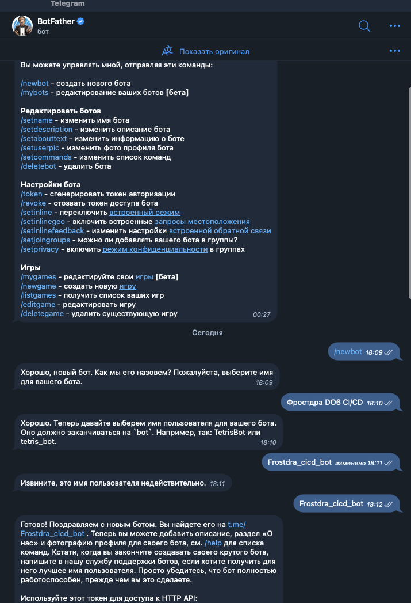  
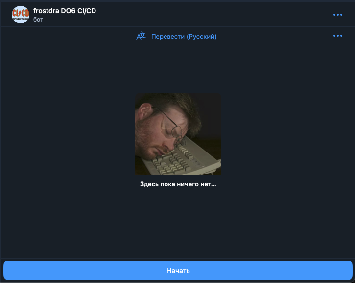  
*Создал телеграмм-бота*  

Написал (см. полезные ссылки - тут все просто) 3 скрипта: ```tg_bot_status_stage.sh```, ```tg_bot_start_deploy.sh```, ```tg_bot_fin.sh```.  
Фукнционал ```tg_bot_status_stage.sh```: если задача этапа успешно завершена, то бот посылает статус и время успешного выполнения задачи этапа, если нет - бот посылает статус и время не успешного выполнения задачи этапа и общий стату по проекту.  
```
#!/bin/bash

TELEGRAM_BOT_TOKEN="7435474656:AAH1aZzJYqaGMmR2ha_Q8NnLFEut6_41GcU"
TELEGRAM_USER_ID="444897129"
DATE_TIME=$(TZ="Europe/Moscow" date +"%Y-%m-%d %H:%M:%S")

TIME="10"
URL="https://api.telegram.org/bot$TELEGRAM_BOT_TOKEN/"

status="🚫"
if [ "$CI_JOB_STATUS" == "success" ]; then 

    # Отправка сообщения о статусе этапа

    status="✅"
    TEXT="Статус этапа +$CI_JOB_STAGE по задаче $CI_JOB_NAME: $status
    Дата-время: $DATE_TIME"

    curl -s --max-time $TIME -d "chat_id=$TELEGRAM_USER_ID&disable_web_page_preview=1&text=$TEXT" $URL"sendMessage" > /dev/null

else

    # КОНЕЦ((
    TEXT="Статус этапа +$CI_JOB_STAGE по задаче $CI_JOB_NAME: $status
    Дата-время: $DATE_TIME"

    curl -s --max-time $TIME -d "chat_id=$TELEGRAM_USER_ID&disable_web_page_preview=1&text=$TEXT" $URL"sendMessage" > /dev/null
    
    sheldon_to_end=https://donate.petridish.pw/sites/default/files/stickers/127260/7_88.png?1633075049
    # Отправка изображения Шелдона
    curl -s --max-time $TIME -F "chat_id=$TELEGRAM_USER_ID" -F "photo=$sheldon_to_end" $URL"sendPhoto" > /dev/null

    TEXT="Статус продакш: ❌
    
    Проект:+$CI_PROJECT_NAME
    Репозиторий:+$CI_PROJECT_URL
    Ветка:+$CI_COMMIT_REF_SLUG
    
    Автор:+$GITLAB_USER_LOGIN
    Дата-время: $DATE_TIME"

    curl -s --max-time $TIME -d "chat_id=$TELEGRAM_USER_ID&disable_web_page_preview=1&text=$TEXT" $URL"sendMessage" > /dev/null

fi
```
*Скрипт ```tg_bot_status_stage.sh```*  

Фукнционал ```tg_bot_start_deploy.sh```: если этапы дошли до момента, когда можно заливатьвсе на прод сервер, то бот посылает запрос на выполнение этапа заливки и ссылку для запуска этапа.  
```
#!/bin/bash

TELEGRAM_BOT_TOKEN="7435474656:AAH1aZzJYqaGMmR2ha_Q8NnLFEut6_41GcU"
TELEGRAM_USER_ID="444897129"
DATE_TIME=$(TZ="Europe/Moscow" date +"%Y-%m-%d %H:%M:%S")

TIME="10"
URL="https://api.telegram.org/bot$TELEGRAM_BOT_TOKEN/sendMessage"

TEXT="Можно запустить этап deploy (размещение на "боевой" сервер).
Для запуска перейдите по ссылке и жмакните кнопочку старт
"$CI_PROJECT_URL/-/pipelines/$CI_PIPELINE_ID"

Автор:+$GITLAB_USER_LOGIN
Дата-время: $DATE_TIME"

curl -s --max-time $TIME -d "chat_id=$TELEGRAM_USER_ID&disable_web_page_preview=1&text=$TEXT" $URL > /dev/null
```
*Скрипт ```tg_bot_start_deploy.sh```*  

Фукнционал ```tg_bot_fin.sh```: если бот отправляет статус этапа как проекта в целом.  
```
#!/bin/bash

TELEGRAM_BOT_TOKEN="7435474656:AAH1aZzJYqaGMmR2ha_Q8NnLFEut6_41GcU"
TELEGRAM_USER_ID="444897129"

# TELEGRAM_BOT_TOKEN="тут токен"
# TELEGRAM_USER_ID="тут id"
DATE_TIME=$(TZ="Europe/Moscow" date +"%Y-%m-%d %H:%M:%S")
TIME="10"
URL="https://api.telegram.org/bot$TELEGRAM_BOT_TOKEN/"

if [ "$CI_JOB_STATUS" == "success" ]; then 
   # Все хорошо

   sheldon_to_end=https://avatars.dzeninfra.ru/get-zen_doc/3668119/pub_5f4a88cafe0a9948592b02a0_5f4a88f16f855d0a7aa70e37/scale_1200; 
   # Отправка изображения Шелдона
   curl -s --max-time $TIME -F "chat_id=$TELEGRAM_USER_ID" -F "photo=$sheldon_to_end" $URL"sendPhoto" > /dev/null

   TEXT="Статус продакш: $1
      
      Проект:+$CI_PROJECT_NAME
      Репозиторий:+$CI_PROJECT_URL
      Ветка:+$CI_COMMIT_REF_SLUG
      
   Автор:+$GITLAB_USER_LOGIN
   Дата-время: $DATE_TIME"

   curl -s --max-time $TIME -d "chat_id=$TELEGRAM_USER_ID&disable_web_page_preview=1&text=$TEXT" $URL"sendMessage" > /dev/null
else
   # КОНЕЦ((
    TEXT="Статус этапа +$CI_JOB_STAGE по задаче $CI_JOB_NAME: $status
    Дата-время: $DATE_TIME"

    curl -s --max-time $TIME -d "chat_id=$TELEGRAM_USER_ID&disable_web_page_preview=1&text=$TEXT" $URL"sendMessage" > /dev/null
    
    sheldon_to_end=https://donate.petridish.pw/sites/default/files/stickers/127260/7_88.png?1633075049
    # Отправка изображения Шелдона
    curl -s --max-time $TIME -F "chat_id=$TELEGRAM_USER_ID" -F "photo=$sheldon_to_end" $URL"sendPhoto" > /dev/null

    TEXT="Статус продакш: ❌
    
    Проект:+$CI_PROJECT_NAME
    Репозиторий:+$CI_PROJECT_URL
    Ветка:+$CI_COMMIT_REF_SLUG
    
    Автор:+$GITLAB_USER_LOGIN
    Дата-время: $DATE_TIME"

    curl -s --max-time $TIME -d "chat_id=$TELEGRAM_USER_ID&disable_web_page_preview=1&text=$TEXT" $URL"sendMessage" > /dev/null

fi
```  
*Скрипт ```tg_bot_fin.sh```*  


Также внес изменения в файл gitlab-ci.yml - не буду выкладывать полностью, в репозитории можно посомтреть, там уже много. Что изменил вкратце:  
```
build_job_cat_ci:
  ...
  after_script:
    - bash src/tg_bot_status_stage.sh

build_job_grep_ci:
  ...
  after_script:
    - bash src/tg_bot_status_stage.sh
  needs:
    - build_job_cat_ci

code_style_ci:
  after_script:
    - bash src/tg_bot_status_stage.sh

tests_cat:
  after_script:
    - bash src/tg_bot_status_stage.sh

tests_grep:
  after_script:
    - bash src/tg_bot_status_stage.sh
    - if [ "$CI_JOB_STATUS" == "success" ]; then bash src/tg_bot_start_deploy.sh #если задача этапа выполнена, то спрашиваем про запуск этапа деплой

deployment_cd:
    after_script:
    - bash src/tg_bot_fin.sh #если деплой выполнен, то телеграмм бот отправит сообщение об успешности, иначе о неуспешности
```

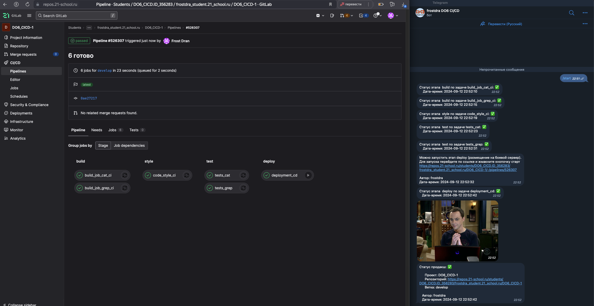  
*Демонстрация работы телеграм-бота*  


</details>

<details>
<summary> == Результат краткий == </summary>

  
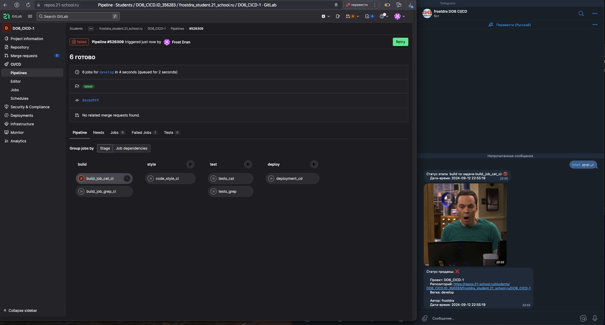  
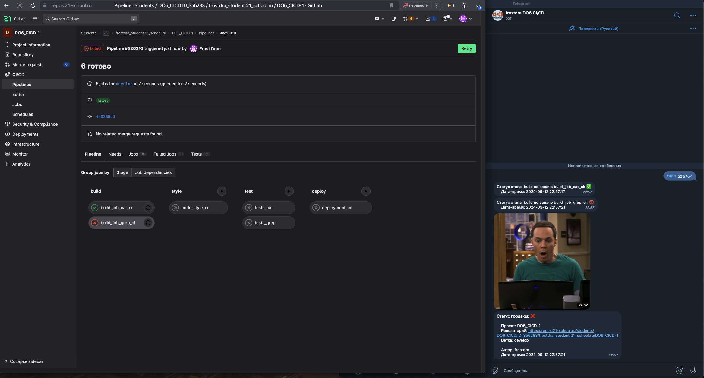  
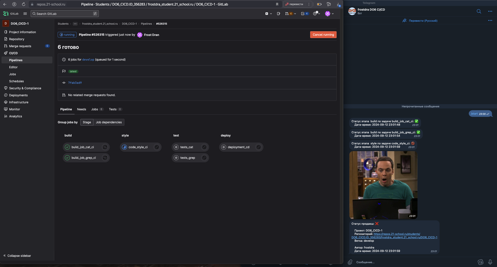  
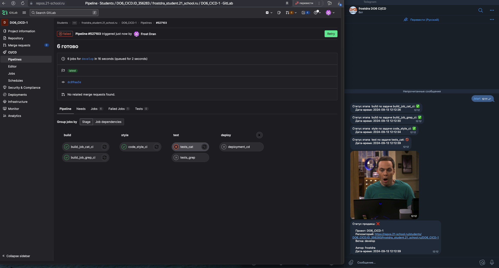  
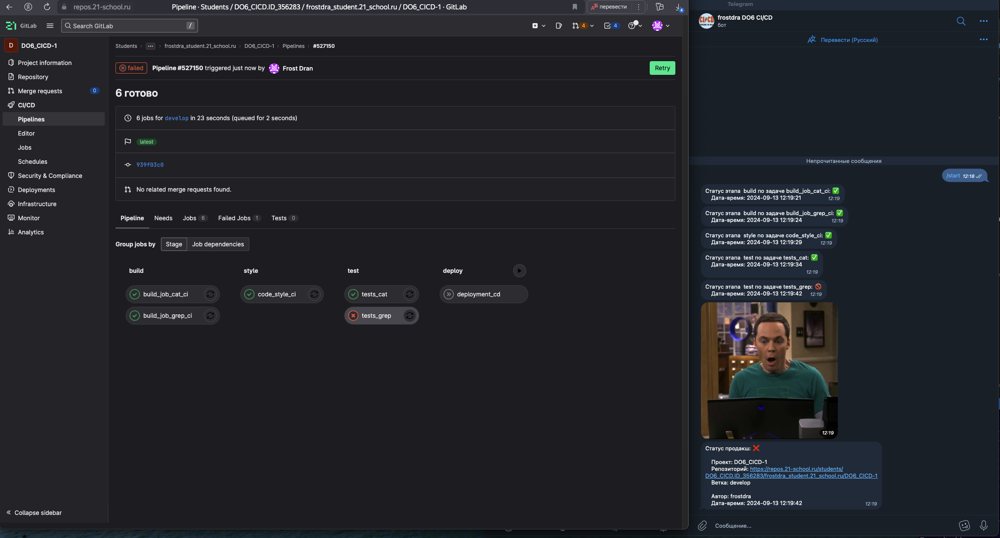  
  
*Работа gitlab CI/CD и telegram-бота*  


</details>

<details>
<summary> == Критичные моменты == </summary>

1. Если этап фелится, но статус ```passed - allowed to fail```, то добавить строку в этап ```allow_failure: false``` тогда если срабатывает ```exit 1``` скрипт завершится с ошибкой, а не с passed.  
2. Если добавить ```set -e``` в скрипт с работтой по копированию файлов и/или подключению на другой сервак, то при ошибке точно зафейлится скрипт, а не не бует passed.  
  
</details>


## **Вместо многих слов...**  

<details>
<summary> == Раскрыть == </summary>

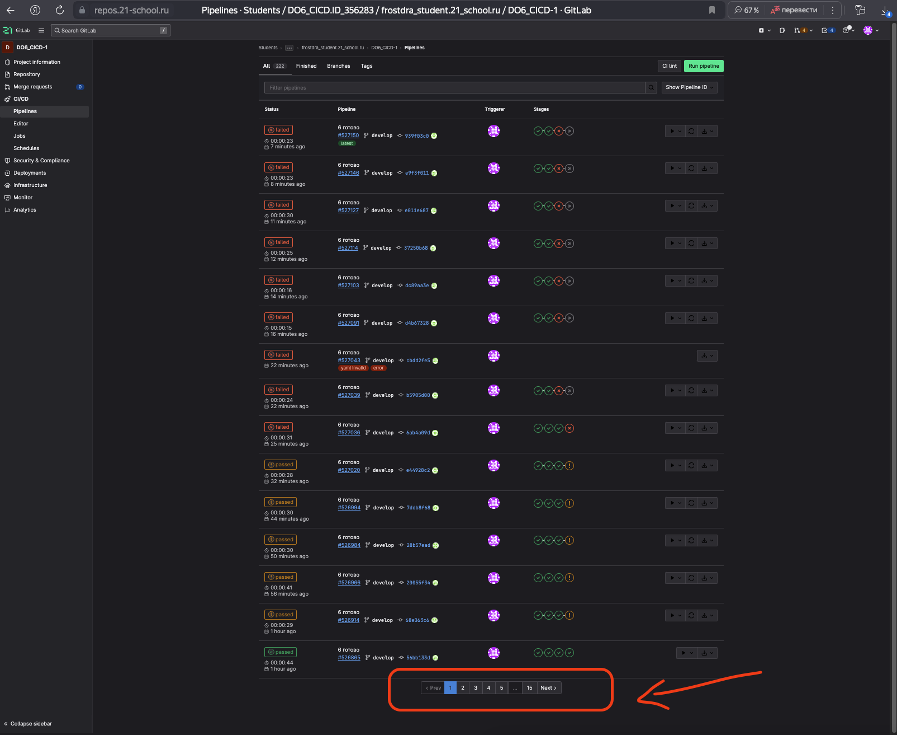  

</details>


## **Полезные ссылки**  

<details>
<summary> == Раскрыть == </summary>

1. https://docs.gitlab.com/runner/install/linux-repository.html - мануал по установке gitlab-runner  
2. https://docs.gitlab.com/runner/register/index.html - мануал по регистрации и запуску gitlab-runner  
3. https://www.reg.ru/blog/rukovodstvo-po-ci-cd-v-gitlab-dlya-novichka/ - про gitlab-ci.yml тут читал  
4. https://www.youtube.com/watch?v=uSTOerrWNaY - смотрел про gitlab-ci.yml  
5. https://telegra.ph/DevOps-FAQ-04-20 - чат в телеге учеников школы - много полезного  
6. !! https://yourtodo.ru/posts/razvertyivanie-prilozhenij-s-gitlab-cicd-rukovodstvo-dlya-razrabotchikov/ - ОТЛИЧНЕЙШИЙ мануал по gitlab-ci.yml  
7. https://timeweb.cloud/tutorials/servers/kak-podklyuchitsya-k-serveru-po-ssh - мануальчик по подключению к серверу по ssh
8. Использование SSH-агента (муторная тема, чтобы ssh-ключи использовать в CI) - https://dev.to/aws-builders/gitlab-ci-pipeline-run-script-via-ssh-to-remote-server-49l0 - https://www.opennet.ru/tips/3132_ssh_gitlab.shtml в результате не пригодилось. Но я пытался прямо.
9. https://ifedyukin.ru/blog/all/gitlab-ci-telegram/ - бот в телеграмм для ci-cd тут прочитал.  
10. https://docs.gitlab.com/ee/ci/variables/predefined_variables.html - переменный gitlab-ci-cd для отражения в боте.  

</details>

